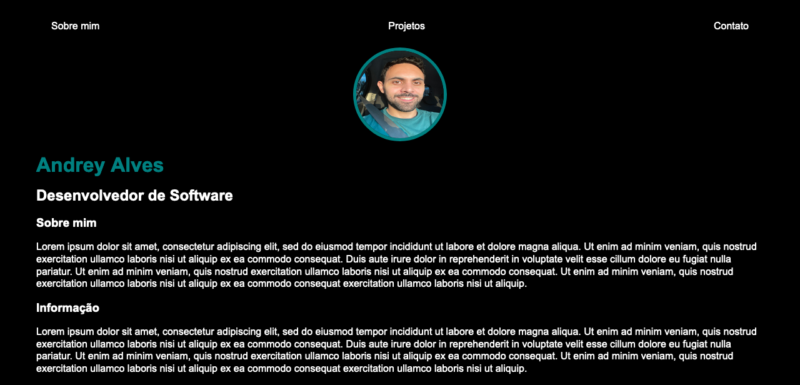

# easy-portfolio - Personal Website

This a simple website coded with only HTML and CSS.

It's is my personal version of the [original project](https://www.youtube.com/watch?v=n_Etdr7Dbjs) from the YouTube channel [Adriana Saty](https://www.youtube.com/@AdrianaSaty).

## Table of contents

- [Overview](#overview)
  - [Screenshot](#screenshot)
  - [Links](#links)
- [My process](#my-process)
  - [Built with](#built-with)
  - [Continued development](#continued-development)
- [Author](#author)

## Overview

### Screenshot

### Links

- Live Site URL: [https://expertiner.github.io/easy-portfolio/](https://expertiner.github.io/easy-portfolio/)

## My process

### Built with

- Semantic HTML5 markup

### Continued development

- Techniques I want to refine and perfect:
  - `nav`
  - margins and paddings.

## Author

- GitHub - [Andrey Alves](https://github.com/Expertiner)

- Linkedin - [Andrey Alves](https://www.linkedin.com/in/andrey-alves-da-silva-02312099/)

- YouTube - [@andreyzices](https://www.youtube.com/channel/UCirtLAIX4JdTRy_Za6GKcwg)

- Frontend Mentor - [@expertiner](https://www.frontendmentor.io/profile/Expertiner)